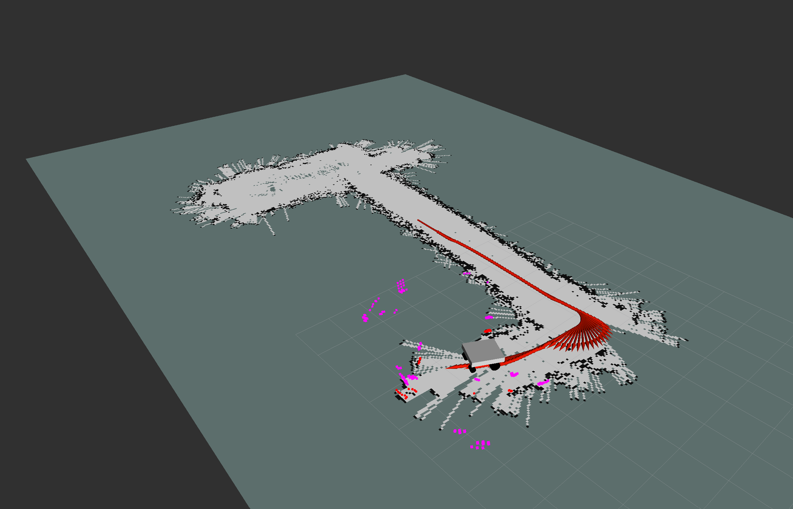
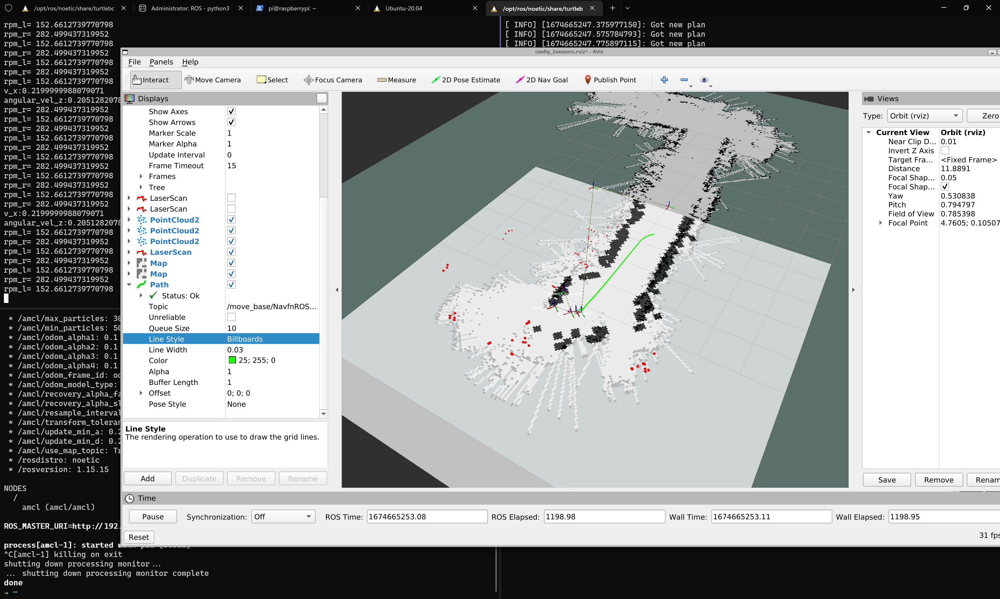

# mmWave ROS SLAM

#### Auhor: Nicola Pace
#### Organization: Politecnico di Bari
#### Email: nicola.pace@poliba.it
---
## Introduction:

This repository contains code to implement SLAM on ROS using multiple mmWave sensors.



This project can be used in two ways:

1. Building the source using `catkin` (the source currently misses some CMake files)
2. Using the [turtlebot3](https://github.com/ROBOTIS-GIT/turtlebot3) and [pointcloud_to_laserscan](https://github.com/ros-perception/pointcloud_to_laserscan) source from apt repositories
   
  

## Installation:

To implement the following source on top of turtlebot3 source, install turtlebot3 ROS packages:

```
sudo apt-get-install ros-noetic-turtlebot3-slam
sudo apt-get-install ros-noetic-turtlebot3-navigation
```

Also install pointcloud to laserscan package:

```
sudo apt-get-install ros-noetic-pointcloud-to-laserscan
```

Then clone this repository and build [ira_laser_tools](https://github.com/iralabdisco/ira_laser_tools) and [ti_mmwave_rospkg](https://github.com/radar-lab/ti_mmwave_rospkg) from the ros_pkgs folder into your `catkin_ws/src` folder using `catkin_make`.

Now, copy config and launch files for SLAM and navigation inside turtlebot3 packages for simplicity.
The following commands assumes ROS folder is: `/opt/ros/noetic/share/`

Inside the repository:

```
sudo cp -p ros_pkgs/poincloud_to_laserscan/launch/  /opt/ros/noetic/share/poincloud_to_laserscan/launch/ 
sudo cp -p ros_pkgs/mmwave_slam/launch/  /opt/ros/noetic/share/turtlebot3_slam/launch/ 
sudo cp -p ros_pkgs/mmwave_slam/config/  /opt/ros/noetic/shareturtlebot3_slam/config/ 
sudo cp -p ros_pkgs/mmwave_navigation/launch/  /opt/ros/noetic/shareturtlebot3_navigation/launch/ 
sudo cp -p ros_pkgs/mmwave_navigation/config/  /opt/ros/noetic/share/turtlebot3_navigation/config/ 
```

Now the workplace is correctly setupped.


## How to use:


### Bringup:

First, launch sensors nodes using `ti_mmwave_rospkg`

```
roslaunch ti_mmwave_rospkg sensors_back.launch
roslaunch ti_mmwave_rospkg sensors_front.launch
roslaunch ti_mmwave_rospkg sensors_LX.launch
roslaunch ti_mmwave_rospkg sensors_RX.launch
```

Now launch your odometry node, the publishes `/tf` and `/odom` for example:

```
roslaunch ros_to_canfd ros_to_canfd_odom.launch
```

Now run Pointcloud to Laserscan node, for example:

```
roslaunch pointcloud_to_laserscan 3point2laser.launch
```

And the Laserscan data merger node:

```
roslaunch ira_laser_tools 3laser_merger.launch 
```

To run laserscan filter:

```
python3 scripts/scan_cluster.py 
```


### SLAM:

To launch SLAM node on unfliterd data, run:

```
roslaunch turtlebot3_slam my_gmapping.launch
```
To launch SLAM node on filtered data, run:

```
roslaunch turtlebot3_slam my_gmapping_filtered.launch
```


### Autonomous navigation:

To launch navigation node:
```
roslaunch turtlebot3_navigation my_move_base.launch 
```


### Rviz visualization:

You can use a custom view and urdf of your robot, and place it in urdf_tutorial pkg and use:

```
 roslaunch urdf_tutorial my_robot.launch
```

or to just view data:
```
 rviz ros_pkgs/rviz/config_final.rviz
```





### Sources:

Sources utilizied in the code are:
1. [ti_mmwave_rospkg](https://github.com/radar-lab/ti_mmwave_rospkg)
2. [ira_laser_tools](https://github.com/iralabdisco/ira_laser_tools)
3. [pointcloud_to_laserscan](https://github.com/ros-perception/pointcloud_to_laserscan)


